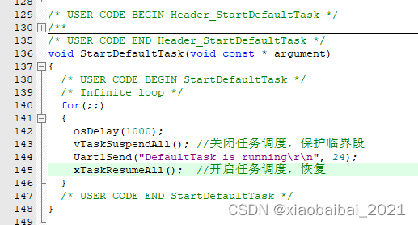
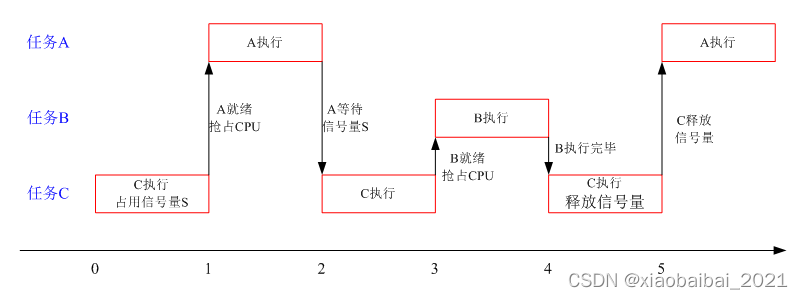
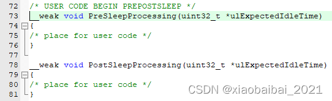

---
html:
    toc: true
---

# <font face="仿宋" font color=#409EFF><center>文件目录</center></font>
## <center><font face ="楷体" sice=5>鑫</font></center>

## 一、任务
 1. **任务创建函数**
    xTaskCreate函数是用动态的方法创建一个任务，而xTaskCreateStatic函数用静态的方法创建任务；使用xTaskCreate创建任务时，系统自动为任务分配内存；而使用xTaskCreateStatic创建任务时，需要用户指定内存地址。
   - **动态方式创建任务-（xTaskCreate）**
    函数原型；
    参数说明；
    pxTaskCode：任务函数的入口，是一个函数指针，指向要执行的任务；
    pcName：任务名称，是一个字符串；
    usStackDepth：任务堆栈大小，注意实际申请的堆栈是usStackDepth个4字节空间；
    pvParameters：传递给任务函数的参数；
    uxPriotiry：任务优先级，范围0~configMAX_PRIORITIES-1；
    pxCreatedTask：任务句柄，任务创建成功以后会返回此任务的句柄，这个句柄其实就是任务的任务堆栈地址；
   - **静态方式创建任务-（xTaskCreateStatic）**
    xTaskCreateStatic函数的参数与xTaskCreate差不多，区别是最后两个参数：
    
    最后两个参数的含义是：
    puxStackBuffer：用户指定的这块内存地址，作为任务堆栈地址；
    pxTaskBuffer：用户指定的这块内存地址，作为任务控制块。

## 二、时间节拍与延时函数
  1. **时间节拍计数获取**
  FreeRTOS的时钟节拍本质上是一个周期性的计数器，那么如何获取计数器的值呢？可以使用xTaskGetTickCount() 或 xTaskGetTickCountFromISR()函数。
  这两个函数都是获取节拍的计数，调用后的返回值就是节拍计数。区别是xTaskGetTickCount()在普通任务函数中使用，而xTaskGetTickCountFromISR()在中断服务程序中使用。
  2. **延时函数**
  - **延时函数-（vTaskDelay）**
    vTaskDelay()函数，其原型为：
    `void vTaskDelay(const TickType_t xTicksToDelay );`
    输入的参数xTicksToDelay就是要延时的节拍数，TickType_t一般是无符号32位整型数。如执行：vTaskDelay(100)；则表示在这里要延时100个时钟节拍。

    使用vTaskDelay()函数要注意FreeRTOSConfig.h配置文件中INCLUDE_vTaskDelay要定义为1（一般默认都已定义为1，因为这个函数太常用了）：
    
  - **精确节拍延时函数-（vTaskDelayUntil）**
    vTaskDelayUntil()也是实现延时，但是它实现的是相对于某个时间点的延时。

    先看一下它的函数原型：

    void vTaskDelayUntil( TickType_t *pxPreviousWakeTime, const TickType_t xTimeIncrement );

    第一个参数pxPreviousWakeTime是指向一个时间基准点；

    第二个参数xTimeIncrement是要延时的节拍数，这个节拍数是相对于第一个参数的时间基准点的，而不是相对于调用此函数的时刻。

    也就是说，vTaskDelayUntil会延时到时间基准点之后xx个节拍。

## 三、任务的调度
  1. **协作式调度**
    **放弃CPU函数（taskYIELD）**
    协作式的调度方式，其本质上是任务在运行一段时间后，自己放弃CPU运行权，让其他任务运行。
    在FreeRTOS里，是通过taskYIELD()这个函数实现放弃CPU的。一个典型的协作式任务是在while(1){}大循环的最后，调用taskYIELD()去主动放弃CPU；这时其他处于就绪态的最高优先级的任务才可能运行；如果其他任务都不在就绪状态，那么仍然回到taskYIELD()后面继续运行原来的任务。
    在FreeRTOS里taskYIELD()是一种放弃CPU执行权的方法，还可以使用我们前面讲的延时函数vTaskDelay，以及后面会讲到的等待信号量、消息队列等等。
    在生成的keil工程中，在FreeRTOSConfig.h文件中，将如下宏configUSE_PREEMPTION定义为0，就使能了协作式调度：
    

  2. **时间片轮转调度**
    时间片轮转的调度方法，是让相同优先级的几个任务轮流运行，每个任务运行一个时间片，任务在时间片运行完之后，操作系统自动切换到下一个任务运行；在任务运行的时间片中，也可以提前让出CPU运行权，把它交给下一个任务运行（这一点和协作式类似）。 
    FreeRTOS的时间片固定为一个时钟节拍，由configTICK_RATE_HZ这个宏设置：
    
    注；使用时间片轮转调度，要把configUSE_PREEMPTION宏定义重新改为1，关闭协作式调度。
  3. **抢占调度** 
    抢占式调度，是最高优先级的任务一旦就绪，总能得到CPU的执行权；它抢占了低优先级的运行机会。在抢占式调度系统中，总是运行最高优先级的任务。
    抢占式调度的特点在于，可以使得一些需要实时运行的任务，能在较短的时间内获得CPU执行权，保证这些实时任务及时执行。
    在FreeRTOS中，抢占式调度，与时间片轮转可以同时存在；当有高优先级任务就绪时，运行高优先级任务；当最高优先级的任务有好几个时，这几个任务可以以时间片轮转方式调度。
    注；使用抢占调度，要把configUSE_PREEMPTION宏定义重新改为1，关闭协作式调度。

## 四、**临界段保护-关中断和关调度**
  1. **临界段概念** 
   简单来讲，<font color=FF0000>临界段是一段执行时不允许被中断（或其他任务）打断的代码</font>；如果被打断，就有可能运行出错。
   举个例子;
   假设我们有一个任务Task1需要向队列FIFO中写入数据，中断服务函数TaskISR1也需要向队列FIFO中写入数据；我们知道，FIFO的写或者读需要依次执行：写入/读出数据、更新读/写指针。
   如果Task1在向FIFO中写入数据时，执行完写入数据，但还没有更新写指针，此时中断来了，TaskISR1开始运行，它也需要向FIFO中写入，而由于Task1运行时还没有更新写指针，则TaskISR写入的数据会把Task1刚刚写入的数据覆盖，然后更新写指针；这就出现了一次丢失数据的错误。
   当然错误还不只如此，中断服务程序TaskISR1运行完毕后，回到Task1继续运行，它会接着被打断的位置向后执行，更新写指针；这样就相当于没有写入数据，但又更新了一次写指针。
   像这个例子中的FIFO写入数据、读出数据的代码段，就是临界段；它的读写数据和更新读写指针，两个操作之间不能被打断，否则就会可能出错。
   <font color=FF0000>用户代码中用于任务和中断间通信的变量、不可重入函数，操作系统的某些底层代码，都有可能是临界段</font>。如果不保护好临界段，代码就会出现各种难以排查、难以复现的bug。
   而<font color=FF0000>最简单的保护临界段的方法，就是关闭中断，以及关闭任务调度</font>。也就是暂时禁止中断和其他任务执行，等到临界段执行完毕后再恢复。具体使用时，如果有可能被中断打断，则关闭中断，如果有可能被高优先级的任务打断，则可以关闭任务调度。
   注意！<font color=FF0000>这种“关闭”是临时的，执行完临界段之后，必须要恢复允许中断和任务调度的状态</font>。否则，中断和其他任务就无法运行了。
   此外，由于执行临界段时，关闭了任务或任务调度，系统无法响应其他的实时事件，<font color=FF0000>会降低系统的实时性</font>；所以我们编写代码时，需要准确识别临界段，使得临界段尽量短，即只把需要保护的最小的一段代码保护起来即可。
   2. **freeRTOS中的临界段保护**
   freeRTOS系统中定义了保护临界段的宏：
   在任务中，taskENTER_CRITICAL()，用于进入临界段前保护；taskEXIT_CRITICAL()，用于临界段执行完之后，退出保护。
   查看代码调用情况，可以看到它们最后是由下述两个函数实现：
   
   这其中除了开/关中断的代码，还有一个嵌套计数，为的是记录进入了几层“关中断”中，这样在退出临界区时，就不会错误地提前退出了。
   其中的开/关中断的操作，是用嵌入的汇编代码实现的，如下所示，关闭中断时，只关闭了优先级低于configMAX_SYSCALL_INTERRUPT_PRIORITY的中断：
   
   <font color=FF0000>由于freeRTOS提供的进入临界段的代码，本质上是关闭中断，而一旦关闭中断，则freeRTOS的任务切换功能也被禁止了，所以，它同时能够保护中断和任务间的临界段冲突。</font>
   另外，如果想要在中断服务程序中进入临界段，要使用另一套函数来保护临界段：taskENTER_CRITICAL_FROM_ISR()，用于进入临界段前保护；taskEXIT_CRITICAL_FROM_ISR( x )用于临界段执行完之后，退出保护。代码的实现是类似的。
   3. **关闭任务调度**
   上述的freeRTOS定义的临界区保护的操作，是直接关闭中断；而实际上，有时有的临界段中断里不访问，只用保护不被其他任务打断即可；这时也可以临时关闭任务调度功能，来实现临界段的保护。
   freeRTOS系统中定义了关闭任务调度和开启任务调度的函数：
   `vTaskSuspendAll()、xTaskResumeAll()`
   这两个函数也需要成对使用，关闭任务调度后，然后执行临界段，最后一定要恢复到开启调度的状态。
   而且，<font color=FF0000>在关闭调度后，不能再使用任何会引起任务切换的函数，如之前讲到的延时vTaskDelayUntil、vTaskDelay，以及以后会讲到的信号量、消息队列等函数</font>；直到重新开启任务调度。
   临界段访问的冲突是不同任务间引起的，我们也可以通过临时关闭任务调度来实现临界段的保护，如下所示：
   

## 五、二值信号量、计数信号量
   1. 什么是信号量
   信号量是操作系统解决资源共享和线程同步的一种方法。
   <font color=FF0000>资源共享</font>：假如我们系统里有一个串口，各个任务都要通过它发送数据，这个串口可以看作共享资源；如果不加控制地让任务随意访问串口，那么很可能会产生一个任务发送了一部分的数据时，串口资源被别的任务抢占，发送了新的数据；这样就出现了共享资源出错。我们希望在一个任务访问串口时，其他需要访问串口的任务暂时等待，直到占用串口的任务用完释放了串口资源，再轮到下一个任务访问。
   信号量就是用来处理这类问题的，我们可以约定，在访问串口资源前，各任务先去竞争获取信号量，获取到信号量的任务可以访问串口，而其他任务被（信号量）阻塞；等到第一个任务访问完，它会释放信号量，让被阻塞的任务再去竞争，之后也是一样，获取到信号量的任务可以获得串口的使用权。这样我们就通过信号量解决了资源共享的问题。
   <font color=FF0000>任务同步</font>：信号量用于任务同步的比较简单，假如多个任务间执行有先后要求，必须任务A完成了事件a，才能执行任务B中的函数b，那么我们可以在事件a之后释放一个信号量，而在b执行之前等待这个信号量，那么就保证了任务A、B中的事件同步执行。
   信号量的作用有点像一些全局的标识量，我们也可以用全局变量来实现资源共享和任务同步，只是信号量还带有阻塞任务的功能，在操作系统里使用起来更为方便。

   2. 二值信号量
   二值信号量顾名思义，它只有两种状态，被占用了可以看作0状态，未被占用可以看作1状态。
   freeRTOS提供的二值信号量，主要由以下几个函数操作：
   - **创建二值信号量**
   SemaphoreHandle_t  xSemaphoreCreateBinary(void)； //创建二值信号量
   SemaphoreHandle_t  xSemaphoreCreateBinaryStatic( StaticSemaphore_t *pxSemaphoreBuffer )； //静态方式创建二值信号量，需用户指定信号量的地址空间

   - **释放二值信号量**
   BaseType_t xSemaphoreGive( SemaphoreHandle_t xSemaphore ); //释放信号量
   BaseType_t xSemaphoreGiveFromISR( SemaphoreHandle_t xSemaphore, signed BaseType_t *pxHigherPriorityTaskWoken); //从中断中释放信号量，后一个参数的返回值表示是否有高优先级的任务已经就绪，如果有，则需要进行一次任务切换

   - **获取二值信号量**
  BaseType_t xSemaphoreTake( SemaphoreHandle_t xSemaphore, TickType_t xTicksToWait ); //获取信号量，后一个参数为阻塞的超时时间
  BaseType_t xSemaphoreTakeFromISR(SemaphoreHandle_t  xSemaphore, BaseType_t *pxHigherPriorityTaskWoken)； //在中断中获取信号量
  - 如果想在中断中发送信号量，可以如下编写代码：
    
    其中选中的两行就是发送信号量，以及处理由高优先级任务就绪的情况。
   3. 计数信号量
   freeRTOS中提供的计数信号量，与二值信号量有些区别，它可以记录发送信号量的次数，也就是说信号量的状态可以不仅仅为0和1，而是可以为自然数，也就是它可以表示一些资源数大于1的情况。
   比如，我们有一块内存空间，共有10个字节，那么可以用一个初值为10的计数信号量来管理，每使用一个空间，信号量减1；每释放一个空间，信号量加1；信号量大于0，则表示有空间可用；信号量减到0，就表示没有空间可用了。
   可以说二值信号量是计数信号量的一种特例，二值信号量是计数值最大为1的计数信号量。
   freeRTOS提供的计数信号量，主要由以下几个函数操作：
   - **创建计数信号量**
   SemaphoreHandle_t xSemaphoreCreateCounting(UBaseType_t uxMaxCount, UBaseType_t uxInitialCount )； //创建计数信号量，两个参数为：最大计数值、初始值
   SemaphoreHandle_t xSemaphoreCreateCountingStatic( UBaseType_t uxMaxCount, UBaseType_t  uxInitialCount, StaticSemaphore_t *  pxSemaphoreBuffer )；//以静态形式创建计数信号量，需用户指定信号量的地址空间
   **释放信号量、获取信号量的函数，与二值信号量相同，这里就不重复了。**
    使用计数信号量时，要将以下宏定义改为1：
   `#define configUSE_COUNTING_SEMAPHORES 1`

   4. 信号量和临界段的关系
   在信号量保护共享资源的用法中，我们发现，信号量所保护的共享资源，和上一节讲过的临界段有些类似，目的都是为了保护某一段代码不被意外访问。
   不同的是，**临界区的保护更加严格一些，它一旦保护，其它中断、任务都不会被执行，只有当前任务执行完才能退出；而信号量的保护不那么严格，它只限制那些等待这个信号量的任务，而与这个信号量无关的任务或中断，是不受影响的。**
   好了，本节的内容就到这里了。下一节我们将继续讲解信号量，探讨一个与它有关的经典问题——优先级反转。

## 六、互斥信号量、优先级反转
   1. **什么是信号量反转**
   假设这样一种情况：
   在一个具有抢占式调度的操作系统中，有三个任务A、B、C，它们优先级从高到低是A>B>C；任务A和C中都会需要获取信号量S。优先级反转产生的例子见下图：
   
   初始0时刻，最低优先级的任务C正在运行，并且获取了信号量S；
   之后，在1时刻，高优先级的任务A进入就绪态，由于它优先级最高，抢占了CPU，A开始运行；
   到2时刻，任务A执行到需要获取信号量S时，发现信号量已经被占用了，所以被阻塞等待；任务A被阻塞后，C重新开始执行；
   到3时刻，中等优先级的任务B进入了就绪态，由于任务B比任务C优先级高，则B抢占了CPU，B进入运行态；
   只有当任务B执行完毕，任务C才能得到执行权；任务C释放信号量之后任务A才能执行。
   这时，就出现了**高优先级的任务A，因为信号量S（或者其他资源）的关系，必须等到中等优先级的任务B执行完了，才能执行的异常现象。这个现象就是优先级反转**。如果任务B执行的时间很长，那么就会导致高优先级的A也需要等待很长时间。
   优先级反转会造成低优先级的任务比高优先级的任务先执行，导致高优先级的任务实时性变差。
 2. **如何解决优先级反转**
   那么，如何解决优先级反转问题呢？一般有两种方法：优先级天花板和优先级继承。
   **优先级继承**：当出现高优先级任务A需要等待低优先级任务C占用的资源时，将C的优先级提高到与A一样（有多个任务等待时，提高到等待它占用资源的任务的最高优先级）。
   **优先级天花板**：当低优先级任务C占用资源时，把C的优先级提高到可能访问该资源的任务的最高优先级（称为该资源优先级天花板）。
   这两种方法的核心思想，都是将占用信号量的任务的优先级临时提高，使得它不会被随意抢占；区别是优先级继承只在高优先级任务被阻塞时提高低优先级任务的优先级，而优先级天花板在低优先级任务获取资源时就提高了自己的优先级。
   我们可以利用下面两个函数来修改、恢复任务的优先级：
   UBaseType_t uxTaskPriorityGet( TaskHandle_t xTask ); //获取任务的优先级
  void vTaskPrioritySet( TaskHandle_t xTask, UBaseType_t uxNewPriority ); //修改任务的优先级
   比如，为了避免优先级反转，我们用优先级天花板方法：C任务取得信号量时，把C任务的优先级提高到与A任务一样；释放信号量时，再把C任务的优先级修改为原来的即可。
   3. **互斥信号量**
   freeRTOS提供的互斥信号量，是一种特殊的二值信号量：
   首先，它与二值信号量的功能差不多，可以实现资源的互斥访问（A获取了B就不能再获取，只能等到A释放之后其他任务才能获取）；
   其次，它**自带了优先级继承功能**，当互斥信号量已经被低优先级任务C获取，如果高优先级任务A需要等待这个信号量，会自动将任务C的优先级提高到与自己相同。
   互斥信号量的功能使得它能避免优先级反转问题。
     - **创建互斥信号量**
      SemaphoreHandle_t  xSemaphoreCreateMutex( void )
      SemaphoreHandle_t  xSemaphoreCreateMutexStatic( StaticSemaphore_t *pxMutexBuffer )
      释放信号量、获取信号量的函数与之前讲过的计数信号量、二值信号量相同，函数内部会自动判断是否是互斥信号量，如果是，它会执行优先级继承相关的调整。
     - **释放互斥信号量**
    BaseType_t xSemaphoreGive( SemaphoreHandle_t xSemaphore ); //释放信号量
    BaseType_t xSemaphoreGiveFromISR( SemaphoreHandle_t xSemaphore, signed BaseType_t *pxHigherPriorityTaskWoken); //从中断中释放信号量，后一个参数的返回值表示是否有高优先级的任务已经就绪，如果有，则需要进行一次任务切换
     - **获取互斥信号量**
    BaseType_t xSemaphoreTake( SemaphoreHandle_t xSemaphore, TickType_t xTicksToWait ); //获取信号量，后一个参数为阻塞的超时时间
    BaseType_t xSemaphoreTakeFromISR(SemaphoreHandle_t  xSemaphore, BaseType_t *pxHigherPriorityTaskWoken)； //在中断中获取信号量
## 七、消息队列
  1. **什么是消息队列**
   操作系统里常说的“消息队列”，和数据结构课程里常说的“队列”是同一个概念，都是一个线性的存储表。
   只不过数据结构里的“队列”通常指的是先进先出队列（也就是FIFO），有一个写入口和一个读出口，从一端写入数据，另一端读出数据，先写入队列的先被读出；而操作系统里实现的消息队列功能会更丰富一些，比如FreeRTOS的消息队列支持FIFO（先进先出）和LIFO（后进先出）两种存取方式，并且它还解决了多任务访问冲突、实现了任务等待队列时的阻塞功能。
   我们以最基本的FIFO队列来讲解一下队列的功能，看下图：
   **图a**初始化时，建立了一个有4个存储空间的队列，读指针指向要读的存储区、写指针指向要写入的存储区，当两个指针指向同一区域时表示队列中没有有效数据；初始时队列中没有数据，读写指针都指向0存储区；
   **图b**表示向队列中写入了一个数据，写指针向后移动了一位，队列中的有效数据为1个；
   **图c**表示向队列中写入了第二个个数据，写指针向后又移动了一位，队列中的有效数据为2个；
   **图d**表示从队列中读取一个数据，由于这是先进先出队列，所以读指针指向的0区域的A1被读走；之后读指针更新到指向存储区1；
   **图e**表示从队列中又读取了一个数据，1存储区的A2被读走，读指针更新到指向存储区2；队列为空。
   
   以上是最基本的先进先出队列。上述的队列，如果不断地写入消息、读出消息，指针不断后移，那么存储区会不够用，所以环形队列应运而生；为了能够更灵活地访问，又有双向队列等等。队列中的数据元素，可以是各种数据类型，也可以是指针。
  2. FreeRTOS的消息队列
   freeRTOS提供的消息队列，可以实现FIFO或者LIFO，数据元素的大小可以由用户指定（比如每个消息大小1字节、4字节等等）。
   还有一点需要注意，freeRTOS的消息队列中传递的是数值，它将要传递的数据复制到了队列存储区中，这与uCOS等操作系统不同，它们一般是传递的数据的地址。
   freeRTOS的消息队列操作，常用的函数有以下几个：
   - **创建消息队列**
   QueueHandle_t xQueueCreate( UBaseType_t uxQueueLength, UBaseType_t uxItemSize ); //uxQueueLength为消息队列长度，uxItemSize为每个消息的字节数；
   这个函数实际上是动态创建的队列，如果想使用静态创建，需要用xQueueCreateStatic函数。
   - **发送消息**
   BaseType_t xQueueSend(QueueHandle_t xQueue, const void * pvItemToQueue, TickType_t xTicksToWait); //xQueue消息队列句柄；pvItemToQueue需传递的消息数据地址；xTicksToWait等待时间；
   发送消息实际上是在队列尾部入队，也就是先进先出；如果想要反过来后进先出，需要使用xQueueSendToFront()函数，它是在队列头部入队。
   xQueueOverwrite()函数，可在队列满时，自动覆盖最旧的消息。
   以上发送消息的函数只能用在任务中，在中断服务程序中发送消息时，需要用带ISR结尾的一套函数。
   - **接收消息**
   BaseType_t xQueueReceive(QueueHandle_t xQueue, void *pvBuffer, TickType_t xTicksToWait); // xQueue消息队列句柄；pvBuffer接收消息队列数据的地址；xTicksToWait等待时间
   BaseType_t xQueuePeek(QueueHandle_t xQueue, void * pvBuffer, TickType_t xTicksToWait);//用于从队列中接收一个消息，但读取之后消息还保留在队列中
   同样，在中断中接收消息时，也需要使用带ISR结尾的一套函数。

## 八、**事件标志组**
   1. **什么是事件标志组**
   一个事件标志组有多个事件位，每个事件位表示了一个事件的标志。
   比如我们用事件标志组的bit0表示事件A、bit1表示事件B、bit2表示事件C，那么这个事件标志组至少可以表示3个事件是否发生。
   之前我们讲过信号量，它用作信号同步时，只能表示一个资源的有无；而事件标志组，它可以同时表示多个资源的有无。
   上述的例子，相当于这个事件标志组实现了等效于3个二值信号量的功能，任务可以在一个事件标志组上同时等待A、B、C三个事件。
   任务在等待事件标志组的事件时，可以选等待该组中的一个或某几个事件位。比如上述例子中，虽然事件标志组表示了A、B、C三个事件，但是用户可以设置为只等待A和B。
   此外，事件标志组与信号量不同的另一点，是它可以选择在等待到某个事件位时是否对该事件位清零。而使用信号量时，获取到一个信号量时，信号量的计数会自动减1。
   2. **FreeRTOS的事件标志组**
   freeRTOS提供的事件标志组，由数据类型EventGroupHandle_t定义。使用前需要确认FreeRTOSConfig.h文件中configUSE_16_BIT_TICKS这个宏的定义，如果定义为1，则一个事件标志组可以最多存储8个事件位，如果定义位0，则可以存储24个事件位。
   下面讲解一下freeRTOS中操作事件标志组常用的一些函数。
   - **创建事件标志组**
   EventGroupHandle_t xEventGroupCreate( void )；//创建一个事件标志组，返回的是创建成功的事件标准组句柄
   这个函数实际上是动态创建的事件标志组，如果想使用静态创建，需要用xEventGroupCreateStatic()函数。
   - **设置事件位**
   最主要是xEventGroupSetBits()、xEventGroupClearBits()两个函数，作用是把事件位置1或清0。函数原型为：
   EventBits_t xEventGroupClearBits(EventGroupHandle_t xEventGroup, const EventBits_t uxBitsToClear); //清0事件标志组，xEventGroup为要操作的事件标准组句柄，uxBitsToClear为要清的事件位，可以同时清多个位
   EventBits_t xEventGroupSetBits(EventGroupHandle_t xEventGroup, const EventBits_t uxBitsToSet ); //设置事件标志组指定位为1，xEventGroup为要操作的事件标准组句柄，uxBitsToClear为要置1的事件位
   上述两个函数只能用在任务中，如果要在中断中设置事件标志组，要使用后缀为ISR的一套函数：xEventGroupSetBitsFromISR()和xEventGroupClearBitsFromISR()。
   - **等待事件位**
   EventBits_t xEventGroupWaitBits(
   EventGroupHandle_t xEventGroup,  /*要等待的事件标志组*/
   const EventBits_t uxBitsToWaitFor, /*要等待的事件位*/
   const BaseType_t xClearOnExit,  /*所等待的事件位是否清零，pdTRUE为清零，pdFALSE不变*/
   const BaseType_t xWaitForAllBits,  /*是否等待所有位，pdTRUE为等待uxBitsToWaitFor指定的所有位，pfFALSE只要uxBitsToWaitFor指定的其中一位置1就返回 */
   const TickType_t xTicksToWait );  /*等待超时时间*/
   - **获取事件标志组的值**
   EventBits_t xEventGroupGetBits( EventGroupHandle_t xEventGroup )；//获取事件标准组的值（不会改变它的值）
   在中断中需要使用xEventGroupGetBitsFromISR这个函数。
## 九、软件定时器
   1. **FreeRTOS的软件定时器介绍**
   freeRTOS的软件定时器，可以设置为单次执行、周期性执行；
   定时时间到时，会执行回调函数（相当于硬件定时器的中断服务程序）；
   定时器的和回调函数中，不能调用会阻塞任务的函数，比如vTaskDelay()、vTaskDelayUntil()以及等待信号量、消息队列之类的函数，否则会引起定时器不正常。
   使用软件定时器，需要在FreeRTOSConfig.h文件中，将configUSE_TIMERS宏定义为1。
   freeRTOS的软件定时器，是通过一个系统内部使用的任务来实现的，就是prvTimerTask函数，这个任务在timers.c文件中定义，是系统自己生成的，用户可以不用管它。
   此外，在FreeRTOSConfig.h文件中，还有一些需要注意的宏定义，见下图：
   
   configTIMER_TASK_PRIORITY定义的是定时器任务的优先级，值可以是0~(configMAX_PRIORITIES-1)，这个值定义的就是定时器任务prvTimerTask的优先级；
   configTIMER_QUEUE_LENGTH定义的是定时器队列的长度，也就是能定义几个软件定时器；
   configTIMER_TASK_STACK_DEPTH定义的是定时器任务的堆栈大小，图中定义的是256字，这个堆栈也是定时器回调函数会使用的堆栈，所以不能定义得太小。
   
   2. **常见的定时器操作函数**
   freeRTOS的定时器由TimerHandle_t类型定义。
    - **创建定时器**
    TimerHandle_t xTimerCreate(
    const char * const pcTimerName, /* 定时器名，字符串 */
    const TickType_t xTimerPeriod, /* 定时器周期，单位为系统时钟节拍 */
    const UBaseType_t uxAutoReload, /* 单次执行或者周期性执行，pdTRUE周期，pdFALSE单次 */
    void * const pvTimerID, /* 定时器ID，这个参数主要用于多个定时器共用一个回调函数时，在回调函数中获取ID来识别是哪个定时器调用的它 */
    TimerCallbackFunction_t pxCallbackFunction /* 定时器回调函数 */ );
    这个函数实际上是动态创建定时器，还可以使用xTimerCreateStatic来静态创建。
    另外需要注意的一点是，定时器的回调函数，只能定义成如下形式：(*TimerCallbackFunction_t)( TimerHandle_t xTimer ); 即传入的参数有且只有一个，就是定时器的句柄；
   - **启动定时器**
   BaseType_t xTimerStart( TimerHandle_t xTimer,    /* 定时器句柄 */
   TickType_t xBlockTime ); /* 成功启动定时器前的最大等待时间设置，单位是系统时钟节拍*/
   这个函数只能在任务中调用，如果想在中断中启动定时器，需要使用xTimerStartFromISR()。
   - **停止定时器**
   BaseType_t xTimerStop( TimerHandle_t xTimer,  /*定时器句柄*/
   TickType_t xTicksToWait )；/*成功停止定时器前的最大等待时间，单位是系统时钟节拍*/
   这个函数只能在任务中调用，如果想在中断中停止定时器，需要使用xTimerStopFromISR()。
   - **获取定时器的ID值**
   void *pvTimerGetTimerID( TimerHandle_t xTimer ); /*输入参数为定时器句柄，返回ID */
## 十、任务通知-更绳资源的同步方式
   任务通知（Task Notifications），它是freeRTOS中实现的另一种通信和同步的方法，在一定程度上可以代替信号量、消息队列、事件标志组的功能；而且**任务通知所需要的资源更少、执行速度更快。**
   1. **FreeRTOS中的任务通知**
    freeRTOS的任务通知，和信号量、消息队列、事件标准组一样，也是一种可以阻塞任务的事件。
    每个任务对应有一个任务通知，任务可以在等待自己对应的任务通知时被阻塞，向该任务通知发送通知可以唤醒该任务；
    任务通知的值，就是任务控制块结构体中的变量ulNotifiedValue，32bit；这也说明了任务通知是和任务一一对应的；
    更新任务通知的值ulNotifiedValue，可以有多种方式：覆盖旧通知值、（如果上次未处理则）不覆盖旧通知值、更新任务通知的某几个bit、增加任务通知值。
    **灵活运用更新任务通知值的方法，可以使任务通知实现信号量、消息队列、事件标志组等的功能。**
    例如：向某个任务发送一个信号量，可以通过将该任务的通知值加1实现；获取信号量，可以将该任务的通知值减1实现；
    向某个任务的通知值中写入一个数据，相对于向该任务发送了一个长度为1的消息；
    设置某个任务通知值的bit0~bit31，可以实现事件标志组。
    任务通知实现的信号量、消息队列、事件标志组，比之前讲过的实现方法占用内存更少、执行速度更快；但是，正是由于任务通知是和任务一一对应的，而且它只有一个32bit的变量ulNotifiedValue来传递信息，使用时有一些限制：
    - 不能同时使用任务通知来传递多个信息，也就是说同一时间对于某个任务，只能实现一个“信号量”或“消息队列”或“事件标志组”的作用；
    - 使用任务通知时，不支持发送信息的超时等待（这一点和之前讲过的信号量、消息队列、事件标志组不同，它们是可以支持超时等待的）。
    使用任务通知功能，需要在FreeRTOS.h文件中，将configUSE_TASK_NOTIFICATIONS宏定义为1。
   2. **常用的任务通知函数**
   - **发送通知**
    BaseType_t xTaskNotify(TaskHandle_t xTaskToNotify, uint32_t ulValue, eNotifyAction eAction ); //三个参数依次为:任务句柄、任务通知值、任务通知值更新方法；
    其中，最后一个参数，任务通知值更新方法，是一个枚举值，在task.h文件中定义：
  ```
  typedef enum
  {
      eNoAction = 0, //未使用，不更新
      eSetBits, //更新指定的bit为1
      eIncrement, //通知值加1
      eSetValueWithOverwrite, //覆写的方式更新通知值
      eSetValueWithoutOverwrite //不覆写通知值
  } eNotifyAction;
  ```
   BaseType_t xTaskNotifyGive( TaskHandle_t xTaskToNotify ); //发送通知，参数为任务句柄，对应任务通知值加1
   BaseType_t xTaskNotifyAndQuery( TaskHandle_t xTaskToNotify, uint32_t ulValue, eNotifyAction eAction, uint32_t * ulPreviousNotificationValue); //该函数和xTaskNotify很相似，多一个最后的参数，用来返回更新前的通知值
   上述几个发送任务通知的函数都是在任务中使用的，如果需要在中断中使用，需要用带后缀ISR的一套函数。
   - **获取通知**
   uint32_t ulTaskNotifyTake( BaseType_t xClearCountOnExit, TickType_t xTicksToWait );
   /*获任务通知；xClearCountOnExit参数为pdFALSE时任务通知值减1（类似计数信号量），参数为pdTRUE时任务通知值清零（类似二值信号量）；该函数更适用于任务通知用作信号量时*/
   BaseType_t xTaskNotifyWait( uint32_t ulBitsToClearOnEntry, uint32_t ulBitsToClearOnExit, uint32_t * pulNotificationValue, TickType_t xTicksToWait );
   /*获取任务通知，函数在执行前，将ulBitsToClearOnEntry的值取反后，和通知值相与来改变通知值；在函数退出前，将ulBitsToClearOnExit的值取反后，和通知值相与来改变通知值；参数pulNotificationValue用来保存任务通知值，参数xTicksToWait为等待时间；该函数更适用于任务通知作为消息队列或者事件标志组时*/

## 十一、动态内存管理
  在FreeRTOS中，动态内存管理是非常重要的功能，之前讲过的任务创建、信号量创建、消息队列的创建等等，都有动态创建和静态创建两种方式。静态创建时，需要用户先定义一块内存区；而动态创建时，不需要指定内存区，系统会自动在堆（heap）中申请一块内存区；这里动态创建时，就用到了动态内存管理的功能；此外，用户的应用程序也可以动态申请内存区使用。
  1. **FreeRTOS动态内存管理**
  说到动态内存管理，我们最容易想到的就是C语言中的动态内存分配函数malloc()，这个函数可以申请一块指定大小的内存区，以指针形式返回内存的地址。用户可以使用这片内存，用完之后要用free()函数来释放，否则会造成内存泄漏。
  在嵌入式系统中，为了提高代码的运行效率，一般不使用标准C的malloc和free函数，通常会用相对简单的方法去实现内存的分配，再封装成与malloc和free相同的函数接口。
  FreeRTOS中，**申请内存的函数原型**如下：
  void *pvPortMalloc( size_t xWantedSize )；//参数为需申请的字节数，返回地址指针；
 ** 释放内存的函数原型**如下：
  void vPortFree( void *pv )； //参数为指向内存的指针；
  虽然FreeRTOS提供了统一的函数接口对应于标准C语言中的malloc和free，但是它们内部的具体实现却有多种方式。FreeRTOS实际上有5种实现动态内存分配的方式，可以由用户选择使用哪一种。下面分别来介绍它们的异同。
  **Heap_1方式：**
  它是5种方法中最简单的，运行效率最高；只支持申请内存，不允许释放；具有时间确定性，不会产生内存碎片；虽然它不支持释放，但是在嵌入式系统下编程一般情况下也够用，因为无论是任务创建、信号量创建等等，在创建之后一般很少需要删除，也就不用释放内存了。
  **Heap_2方式：**
  支持内存申请、内存释放；但不支持内存碎片整理（也就是释放后的空闲小内存块不会被合并成大内存块）。
  Heap_2方式比较适用于动态分配的内存块大小都是一样的情况，比如每次创建队列时，长度一样，这样不会产生内存碎片。使用时先用pvPortMalloc函数申请内存，得到内存块指针后，再用静态方式创建资源，使用完之后用vPortFree函数释放内存。
  **Heap_3方式：**
  对编译器提供的malloc和free进行了封装，需要编译器提供malloc和free的实现。
  **Heap_4方式：**
  支持内存申请、内存释放；并且支持内存碎片整理。
  **Heap_5方式：**
  这种方式是在heap_4的基础上，增加了对不连续的内存区的支持，也就是堆空间可以是不连续的空间；比如我们单片机内部有SRAM，外部也可以挂载SRAM或SDRAM，如果想把这样两片不连续的地址空间都管理起来，可以用heap_5方式来进行动态内存管理。
  使用heap_5方式进行动态内存管理时，需调用vPortDefineHeapRegions函数进行初始化，之后才能调用申请内存、动态创建任务、动态创建信号量之类的申请内存操作。
  FreeRTOS的堆空间大小由configTOTAL_HEAP_SIZE宏来确定；除了heap_3方式，其他的几种内存分配方式，都是在这个堆空间里分配的。
  使用FreeRTOS的堆空间作为动态内存时（也就是除heap_3之外），可以用xPortGetFreeHeapSize()函数来获取剩余可用堆空间的大小。使用heap_4或heap_5时，可以用xPortGetMinimumEverFreeHeapSize()函数来获取历史剩余可用空间的最小值。

## 十二、Tickless低功耗模式
  Tickless在许多小型RTOS中都有应用，是一种通用的实现低功耗的方法；需要注意的是，Tickless只是操作系统层面的实现手段，实质上是帮助用户识别可以进入低功耗的时间段，真正进入低功耗模式还需要MCU的硬件支持。
   1. **tickless模式的原理**
   我们知道，FreeRTOS的任务，是以系统滴答时钟节拍来运行的，执行完一段工作后，任务可以调用系统的延时函数（如vTaskDelay）来延时一定的时钟节拍周期，之后再次运行。
   假如所有的任务都暂时执行完毕，进入了阻塞态，那么此时就可以进入CPU的低功耗模式来减少能量的消耗；只要在最近的需要运行任务的那个时钟节拍唤醒CPU，就不会对各个任务的执行产生任何影响。
   举一个例子便于理解，见下图：
   在时间0~2时，任务A、B、C有可能运行，会一直有用户任务占用CPU；
   到时刻2时，任务A、B、C都进入阻塞态，空闲任务得到运行；
   到时刻4时，又有任务进入到了运行态，那么CPU会退出空闲任务，执行运行态的任务。
   在这一段过程中，时刻2~4之间的两个时钟节拍，就可以使MCU进入低功耗模式，只要在时刻4把MCU唤醒，那么用户任务的执行就不受任何影响。
   
   FreeRTOS中的tickless模式的功能，就是在空闲任务执行时（代表没有用户任务在执行），进入MCU的低功耗模式，然后在最近的需要唤醒MCU的那个时钟节拍时，把MCU唤醒，再更新时钟节拍的计数（使得时钟不会因为进入低功耗而漏计节拍数）。
   从tickless的原理上来看，进入低功耗模式的时间点很好确定，因为所有的用户任务都不执行时，就会进入空闲任务，所以我们只需要在空闲任务中执行进入MCU低功耗模式的操作就可以了。
   退出低功耗模式时，如果是被中断唤醒，那么不需要做特殊的处理，只需要在唤醒后更新时钟节拍数；而如果是任务延时后被唤醒，就有点麻烦了，因为需要计算所有任务的延时，选出离运行时刻最短的那个，在这个时钟节拍来唤醒MCU，并更新时钟节拍数。由于多个任务同时运行，它们的延时、阻塞都不确定，而且是动态变化的，它们之间的延时还有交叉、重叠，所以让MCU休眠多长时间是很难确定的。
   而FreeRTOS的tickless模式的强大之处在于它将这个需要唤醒的时长帮我们计算好了，我们甚至不需要知道这个时长是多少，也不需要知道它在哪起的作用，只要开启了tickless模式，它就会在空闲任务中让MCU进入低功耗模式，并且在最近的需要运行任务的那个时钟节拍将MCU唤醒；顺便把更新时钟节拍的工作也干了。
   2. **FreeRTOS中低功耗模式使用**
   使用Tickless模式几个重要的宏定义和函数：
   -  要想使用tickless模式，要先将FreeRTOSConfig.h文件中的宏configUSE_TICKLESS_IDLE定义为1。
   -  另外一个重要的宏，是在FreeRTOS.h文件中定义的configEXPECTED_IDLE_TIME_BEFORE_SLEEP，这个宏定义了一个周期数，只有空闲任务连续执行的时间大于这个周期，才会进入低功耗模式。这个宏定义是不能小于2的，也就是说，只有系统计算出有两个或以上的周期只运行空闲任务时，才会进入低功耗模式。
   -   portmacro.h文件中的portSUPPRESS_TICKS_AND_SLEEP()宏，是进入和退出低功耗模式的关键，它会被空闲任务调用，完成进入和退出低功耗的工作，并更新系统时钟节拍计数；这是tickless模式工作的最主要的一个函数。使用STM32的话，FreeRTOS已经帮我们把这个宏实现好了。如果是HAL库生成的，一般在port.c文件中，由vPortSuppressTicksAndSleep这个函数实现，可以看到其中有这么几行：
   
   中间的__wfi();这句，其实就是嵌入的汇编指令WFI，即进入低功耗模式。
   如果是其他硬件平台，可能需要自己编写这个宏或函数，并且configUSE_TICKLESS_IDLE宏定义要改为2，即使用自定义的低功耗处理函数。
   -  configPRE_SLEEP_PROCESSING()和configPOST_SLEEP_PROCESSING()宏，会在portSUPPRESS_TICKS_AND_SLEEP()实现的宏里面被调用，见上图，它们是需要用户编写的。这两个宏是用在MCU进入低功耗模式前、退出低功耗模式后执行的操作。一般在进入低功耗模式前，可以设置降低时钟主频、改为内部RC时钟、关闭一些无必要的外设等等，以降低硬件功耗；而退出低功耗模式后，需要将这些设置恢复。
   默认情况下，这两个函数是空函数，用户可以自行添加需要的操作，如关闭部分外设的时钟，等等：
    
    
    设置好以上几项，就可以使用低功耗模式了。
## 十二、空闲任务
   1. **空闲任务的功能**
   在freeRTOS中，空闲任务是自带的一个任务，是系统后台自动创建的；顾名思义，它是在处理器空闲的时候才运行的一个任务，也就是当所有用户任务都不在运行态时，它才会被运行；它的优先级永远最低。
   我们知道，在裸机程序中，主函数中一般有个无限循环，在循环中依据各种条件去执行用户程序，如果没有用户程序需要执行，CPU它也会在无限循环里空转。空闲任务在RTOS中的作用，就相当于没有任务需要执行时CPU的空转。
   实际上，在空闲任务中，也可以插入一些有用的操作，例如：上一节我们讲过的低功耗模式，就是利用了当其他任务都没有在运行时，会进入空闲任务，那么就可以在空闲任务中开启低功耗模式；另外，如果某个任务要调用vTaskDelete()删除自己，那么这个任务的任务控制块TCB、任务堆栈等等，就需要在别的任务里释放，这些释放功能最好就是放在空闲任务中。
   2. **空闲任务的钩子函数**
   由于空闲任务是freeRTOS自动创建的，它的任务函数是在tack.c文件中：
   
   但是实际上，我们完全可以不关心它是怎么实现的。如果我们想在空闲任务运行时，执行一些特定的功能，可以使用空闲任务的钩子函数。我们只需要知道如何使用它的钩子函数就可以了。
   这里解释一下什么是钩子函数，“钩子”实际上是hook这个单词翻译过来的，字面意思很不好理解，而实际上，钩子函数其实就是个回调函数。钩子函数在空闲任务中被调用了，用户可以通过实现回调函数的方式，将自己需要执行的功能，插入到空闲任务中执行。
   在空闲任务的实现函数中，可以找到调用了一个vApplicationIdleHook()函数，这就是它的钩子函数：
   
   用户只要重写这个函数，就可以把想要执行的功能插入到空闲任务中执行。

## 十三、系统配置和中断配置
   很多RTOS之所以可以用于资源很少的单片机，是因为它们可以配置。一般可以使用宏定义来选择需要的功能，而裁剪掉不必要的功能。
   1. FreeRTOS的系统配置
   FreeRTOS的系统配置文件是FreeRTOS.h和FreeRTOSConfig.h。一般来说，FreeRTOS.h中包含了完整的配置选项，而用户使用时，可以在FreeRTOSConfig.h配置自己需要的选项。
   举个例子：
   在FreeRTOS.h中，用#ifndef定义了是否使用信号量和定时器的宏，如果用户没有在其他地方定义这几个宏，那么这里就会定义为0：
   
   用户如果想启用信号量，直接在FreeRTOSConfig.h中重新定义一个宏configUSE_MUTEXES为1，就可以启用了，如下所示：
   
   除了我们前面的课程讲到的一些宏的配置，这里再介绍几个常用的配置宏定义：
   #define configCPU_CLOCK_HZ  ( SystemCoreClock ) //定义CPU时钟主频
   #define configTICK_RATE_HZ  ((TickType_t)1000) //定义FreeRTOS的基本时钟节拍频率，一般定义为1000Hz或更小一些的值，值越大会导致系统运行的开销变大
   #define configMAX_PRIORITIES   ( 7 ) //定义用户可使用的任务优先级，如定义为7则用户可用优先级为0~6，值越大优先级越高
   2. FreeRTOS的中断配置
   中断配置也是FreeRTOS系统配置的一部分，之所以单独拿出来讲，是因为它比较重要。
   中断配置主要有以下几个宏：
   
   它们的作用其实在注释里已经有说明了，这里再详细解释一下。
   **configPRIO_BITS**宏定义的是MCU使用几位优先级，STM32固定为4位，硬件上限定了是用4个bit来进行优先级分组的。详细讲解可以参见笔者以前的文章《【STM32+cubemx】0007 HAL库开发：外部中断，优先级和中断向量表》。
   **configLIBRARY_LOWEST_INTERRUPT_PRIORITY**宏用来定义最低优先级的数值，在M3内核的MCU中，一般FreeRTOS推荐优先级分组全部设置位抢占模式，即4bit来设置也就是优先级为0~15，所以最低优先级为15，（注意这里是值越大优先级越低）。
   见下图，我们之前在cubemx中建立工程的时候，就是用的默认的4bit来表示优先级分组，同时，可以看到SysTick被设置成了最低优先级，这是合理的，因为一般情况下，中断的优先级就是要比任务切换的优先级高，所以用作时钟节拍的中断SysTick被设置成了最低优先级的中断：
   
   **configLIBRARY_MAX_SYSCALL_INTERRUPT_PRIORITY**宏用来定义可以被FreeRTOS管理的最高优先级中断，这里定义为5，也就是说优先级高于5的中断FreeRTOS是不可管理的。
   在前面的讲解中，我们知道FreeRTOS提供了一套带ISR结尾的函数可以在中断服务程序中调用，这里要特别注意，**如果是FreeRTOS不可管理的高优先级中断，它的中断服务程序中也是不能使用这些ISR结尾的函数的！同时，FreeRTOS的开、关中断功能，也不能管理比这个宏优先级高的中断**。FreeRTOS只管理一部分低优先级中断，使得有些高优先级的中断可以得到最快的响应。


## 原文链接：
https://blog.csdn.net/little_grapes/category_11799940.html?spm=1001.2014.3001.5482
