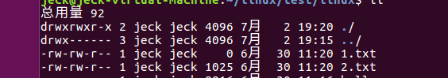

---
html:
    toc: true
---


# <center><font face="仿宋" font color=orange>Markdown入门教程</font>
# <center><font face ="楷体" sice=5>鑫</font></center>

## 一、Linux应用开发：文件IO基础
### 1. 前言
   学Linux应用开发前，先提前了解Linux一个特性：Linux下一切皆文件，这句话是指，Linux世界中的所有东西都可以通过文件的方式访问、管理，简单一点理解他就是一种面向对象的设计思想，把一切外设当做文件，访问处理外设的方式和访问处理文件的思路基本相同，虽然一些是硬件外设，看起来和文件没什么关系，但实际上每一个硬件设备都会对应于Linux系统下的某一个文件，我们把这类文件称为设备文件，使用open函数打开任何文件成功情况下便会返回对应的文件描述符，然后就可以对文件描述符进行操作，所以在学习Linux程序设计之前，必须先了解一下Linux下文件的操作方式，为后面的学习做铺垫。

### 2. 文件的操作
#### 2.1文件描述符概念
   当调用open函数打开一个现有文件或创建一个新文件时，内核会向进程返回一个文件描述符，用于指向被打开的文件，所有执行IO操作的API调用都是通过文件描述符来索引到对应的文件，例如下面的代码，调用open后返回了一个fd1文件描述符，后面读取操作直接对文件描述符进行操作就可以。
   ```
        //...
        int fd1，state;
        char buff[1024];
        
        fd1=open("./1.txt",O_RDONLY);	//获取文件描述符

        state=read(fd1, buff, sizeof(buff));  //通过描述符对文件进行操作
        if(state == -1)
            printf("Read Failed!");
        else
            printf("Read Success!");
        //...
   ```

>一个进程可以打开多个文件，但在Linux系统中，一个进程可以打开的文件数是有限制，并不是可以无限制打开很多的文件，可以通过ulimit命令来查看进程可打开的最大文件数     

`ulimit -u`

文件描述符是从0开始分配的，比如进程中第一个被打开的文件对应的文件描述符是0、第二个文件是1、第三个文件是2、第4个文件是3…；但在程序中调用open函数打开文件的时候，分配的文件描述符一般都是从3开始，因为0、1、2这三个文件描述符已经默认被系统占用了，分别分配给了系统标注输入-0、标注输出-1，以及标准错误-2。

#### 2.2 文件的打开与关闭
##### 2.2.1 open()打开文件
Linux系统中要操作一个文件，需要先打开该文件，得到文件描述符，open函数用于打开文件

>除了打开已经存在的文件之外，还可以创建一个新的文件

函数原型如下：

`int open(const char *pathname, int flags, mode_t mode);//mode在flags为某些参数时才用到`

参数对应表：

|参数	|功能|
|:-:|:-:|
|pathname	|目标文件路径（绝对路径或相对路径）|
|flags	|调用open函数时需要提供的标志，包括文件访问模式标志以及其它文件相关标志，具体模式参照下表|
|mode	|此参数用于指定新建文件的访问权限,只有当flags参数中包含O_CREAT或O_TMPFILE标志时才有效|

flag常用参数功能表：
|参数	|功能|
|:-:|:-:|
|O_RDONLY	|以只读方式打开文件|
|O_WRONLY	|以只写方式打开文件|
|O_RDWR	|以可读可写方式打开文件|
|O_CREAT	|如果pathname参数指向的文件不存在则创建此文件|
|O_DIRECTORY	|如果pathname参数指向的不是一个目录，则调用open失败|
|O_EXCL	|此标志一般结合O_CREAT标志一起使用，用于专门创建文件。在flags参数同时使用到了O_CREAT和O_EXCL标志的情况下，如果pathname参数指向的文件已经存在，则open函数返回错误。|
|O_NOFOLLOW	|如果pathname参数指向的是一个符号链接，将不对其进行解引用，直接返回错误。|
|O_TMPFILE	|用于创建一个临时文件|

###### Tips1：
>使用open函数需要包含如下头文件
>```
>#include <sys/types.h>
>#include <sys/stat.h>
>#include <fcntl.h>
>```
>且以上参数使用需要注意如下点：
>
>O_RDONLY、O_WRONLY、O_RDWR三个参数必须要使用其中一个用来指定文件的初始权限
>使用了O_CREAT、O_TMPFILE标志后，第三个参数mode才有效
>O_EXCL主要用于测试一个文件是否存在，结合O_CREAT使用，如果不存在则创建此文件，如果存在则返回错误，这使得测试和创建两者成为一个原子操作

###### Tips2：

>所谓原子操作是指不会被线程调度机制打断的操作，这种操作一旦开始，就一直运行到结束！

###### Tips3：

>不同内核版本所支持的flags标志是存在差别的，譬如说新版本内核所支持的标志可能在老版本是不支>持的，亦或者老版本支持的标志在新版本已经被取消、替代，具体标志内容可以通过man手册查询，man>手册中对一些标志是从哪个版本开始支持的有简单地说明
>`
>man 2 open 	#查询open系统调用指令的手册
>`
>man命令后面跟着两个参数，数字2表示系统调用，man命令除了可以查看系统调用的帮助信息外，还可>以查看Linux命令（对应数字1）以及标准C库函数（对应数字3）所对应的帮助信息；最后一个参数open>表示需要查看的系统调用函数名

标志使用方法：
```
open("./src_file", O_RDONLY) //单独使用某一个标志 
open("./src_file", O_RDONLY | O_NOFOLLOW) //多个标志组合
```

###### mode参数说明：

mode参数用于指定新建文件的访问权限，只有当flags参数中包含O_CREAT或O_TMPFILE标志时才有效，当我们调用open函数去新建一个文件时，也需要指定该文件的权限，而mode参数便用于指定此文件的权限，mode参数的类型是mode_t，这是一个u32无符号整形数据，权限表示方法如下所示


由低的位向高的位看去，每3个bit位分为一组，分别表示：
O — 这3个bit位用于表示 其他用户的权限
G — 这3个bit位用于表示 同组用户（group）的权限，即与文件所有者有相同组ID的所有用户
U — 这3个bit位用于表示 文件所属用户的权限，即文件或目录的所属者
S — 这3个bit位用于表示 文件的特殊权限，文件特殊权限一般用的比较少，这里就不细讲

>3个bit位中，按照rwx顺序来分配权限位，为1时表示具有读权限，为0时没有读权限

对应的权限在Linux中有定义好的宏来调用，用户使用时就不需要自己研究位数的分配，宏定义如下：

|权限|	所有者|	同组用户	|其他用户|
|:-:|:-:|:-:|:-:|
|读	|S_IRUSR|S_IRGRP|S_IROTH|
|写	|S_IWUSR|S_IWGRP|S_IWOTH|
|执行|S_IWUSR|S_IXGRP|S_IXOTH|
|读、写、执行一体|S_IRWXU|S_IRWXG|S_IRWXO|

|权限	|set-user-ID（特殊权限）|	set-group-ID（特殊权限）|	sticky（特殊权限）|
|:-:|:-:|:-:|:-:|
|特殊权限|	S_ISUID	|S_ISGID|	S_ISVTX|

这些宏既可以单独使用，也可以通过位或运算将多个宏组合在一起

`S_IRUSR | S_IWUSR | S_IROTH`

**函数返回值： ** 成功将返回文件描述符，文件描述符是一个非负整数；失败将返回-1。

##### 2.2.2 close关闭文件
可调用close函数关闭一个已经打开的文件，其函数原型如下所示
```
#include <unistd.h>

int close(int fd);
```

>使用close函数需要先包含unistd.h头文件

参数： 传入参数fd为文件描述符，需要关闭的文件所对应的文件描述符
返回值： 如果成功返回0，如果失败则返回-1

>除了使用close函数显式关闭文件之外，在Linux系统中，当一个进程终止时，内核会自动关闭它打开的所有文件，显式关闭不再需要的文件是良好的编程习惯，会使代码更具有可读性，也更可靠，进而言之
同时注意文件描述符是有限资源，当不再需要时最好将其释放、归还于系统！

#### 2.3 文件的读取与写入
##### 2.3.1 write()写文件
调用write函数向打开的文件写入数据，函数原型如下
```
#include <unistd.h> 

ssize_t write(int fd, const void *buf, size_t count);
```
使用write函数需要先包含unistd.h头文件。

参数：
|参数|	含义|
|:-:|:-:|
|fd|	文件描述符|
|buf|	要写入的数据对应的缓冲区，传入指针|
|count|	指定写入的字节数|

>读写操作都是从文件的当前位置偏移量处开始，当然当前位置偏移量可以通过lseek系统调用进行设置，关于此函数后面再讲

返回值： 如果写入成功，则返回成功写入的字节数，如果失败则返回-1

##### 2.3.2 read()读文件
调用read函数可从打开的文件中读取数据，其函数原型如下所示
```
#include <unistd.h> 

ssize_t read(int fd, void *buf, size_t count);
```
>使用read函数需要先包含unistd.h头文件

参数：
|参数|	含义|
|:-:|:-:|
|fd	|文件描述符|
|buf|	用来存放读取数据的缓冲区，传入指针|
|count	|指定读取的字节数|

返回值： 如果读取成功将返回读取到的字节数，如果失败则返回-1

2.4 文件读写位置偏移
每个打开的文件，系统都会记录它的读写位置偏移量，我们也把这个读写位置偏移量称为读写偏移量，记录了文件当前的读写位置，当调用read()或write()函数对文件进行读写操作时，就会从当前读写位置偏移量开始进行数据读写，打开文件时，会将读写偏移量设置为指向文件开始位置处，以后每次调用read()、write()将自动对其进行调整，以指向已读或已写数据后的下一字节，而调用seek函数，可以手动修改偏移量，改变读写位置，函数原型如下：
```
#include <sys/types.h> 
#include <unistd.h> 

off_t lseek(int fd, off_t offset, int whence);
```
调用lseek函数需要包含<sys/types.h>和<unistd.h>两个头文件

函数参数：
|参数|	含义|
|:-:|:-:|
|fd|文件描述符|
|offset|偏移量，以字节为单位|
|whence|用于定义参数offset偏移量对应的参考值，该参数为下列宏定义中的一种|

|宏定义|含义|
|:-:|:-:|
|SEEK_SET|偏移量从文件头部开始算|
|SEEK_CUR|偏移量从当前位置开始算|
|SEEK_END|偏移量将从文件末尾开始算|

返回值： 成功将返回从文件头部开始算起的位置偏移量（字节为单位），也就是当前的读写位置；发生错误将返回-1。

### 3.实例编程
打开一个已经存在的文件（例如src_file），使用只读方式；然后打开一个新建文件（例如dest_file），使用只写方式，新建文件的权限设置如下：
1. 文件所属者拥有读、写、执行权限；
2. 同组用户与其他用户只有读权限。
3. 从src_file文件偏移头部500个字节位置开始读取1Kbyte字节数据，然后将读取出来的数据写入到dest_file文件中，从文件开头处开始写入，1Kbyte字节大小，操作完成之后使用close显式关闭所有文件，然后退出程序。
   
参考代码
```
 #include <sys/types.h>
 #include <sys/stat.h>
 #include <fcntl.h>
 #include <unistd.h>
 int main(void)
 {
     char buff[1024]={0};
     int fd1, fd2;
     int ret;
     /* 打开源文件 src_file(只读方式) */
     fd1 = open("./1.txt", O_RDONLY);
     if (-1 == fd1)
         return fd1;
     /* 打开目标文件 dest_file(只写方式) */
     fd2 = open("./2.txt", O_WRONLY);
     if (-1 == fd2) {
         ret = fd2;
         goto out1;
     }
     /* 读取源文件 1KB 数据到 buff 中 */
     ret = read(fd1, buff, sizeof(buff));
     if (-1 == ret)
         goto out2;
     /* 将 buff 中的数据写入目标文件 */
     ret = write(fd2, buff, sizeof(buff));
     if (-1 == ret)
         goto out2;
     ret = 0;
     out2:
     /* 关闭目标文件 */
     close(fd2);
     out1:
     /* 关闭源文件 */
     close(fd1);
     return ret;
 }
```
gcc编译


运行结果：



## 二、Linux应用开发：文件IO进阶


